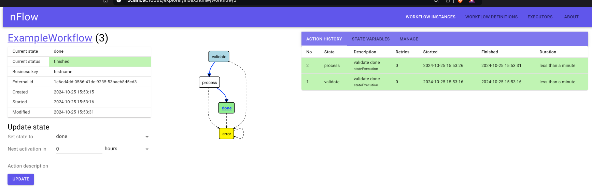
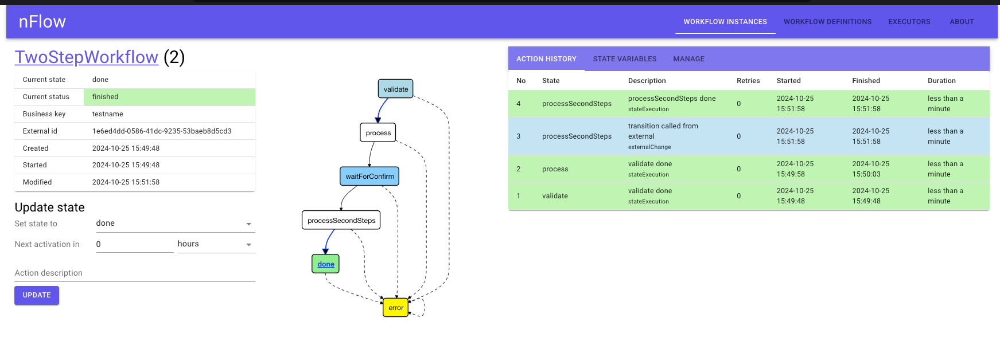

# Nflow Spring boot with spring security and basic API access control

## Description

an exploration of nflow with a spring security interceptor and integration tests with the h2 database

* the nflow explorer and nflow api endpoints are protected by spring security.
* the rest api endpoints are protected by an api key from the app properties file

## Running the application

    mvn clean install
    mvn spring-boot:run

on startup you can load
http://localhost:18092/login

then login with the username and password set in the app.properties

    nflow
    nflow

# Example workflow, this is validated with the api key

    curl --location 'http://localhost:18092/api/example/createWorkflow' \
    --header 'X-API-KEY: 285fbe27-e5e0-4f2b-9b67-9f59dc2ee639' \
    --header 'Content-Type: application/json' \
    --data '{
    "id":"6e6ed4dd-0586-41dc-9235-53baeb8d5cd3",
    "name":"testname",
    "description":"the description"
    }'

## TwoStepWorkflow

an example showing one api request creating a workflow and then a second request that marks an external change to transition the workflow

    curl --location 'http://localhost:18092/api/twostep/createWorkflow' \
    --header 'X-API-KEY: 285fbe27-e5e0-4f2b-9b67-9f59dc2ee639' \
    --header 'Content-Type: application/json' \
    --data '{
    "id":"1e6ed4dd-0586-41dc-9235-53baeb8d5cd3",
    "name":"testname",
    "description":"the description"
    }'

### Once that is in the waitForConfirm state this second request will transition the workflow

    curl --location 'http://localhost:18092/api/twostep/transition' \
    --header 'X-API-KEY: 285fbe27-e5e0-4f2b-9b67-9f59dc2ee639' \
    --header 'Content-Type: application/json' \
    --data '{
    "id":"1e6ed4dd-0586-41dc-9235-53baeb8d5cd3"
    }'
